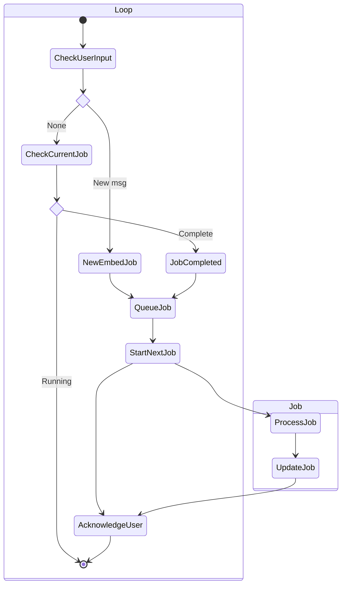

# Raspberry Pi Micro-Agent

Lightweight micro-agent running on a Raspberry Pi for LLM function calling and task orchestration.

User commands are queued and processed asynchronously throughout the day.

### Simplified State diagram of the agent
